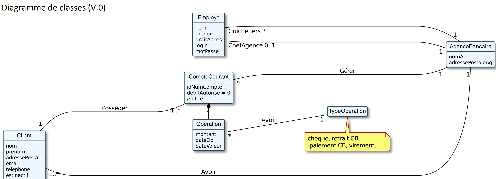
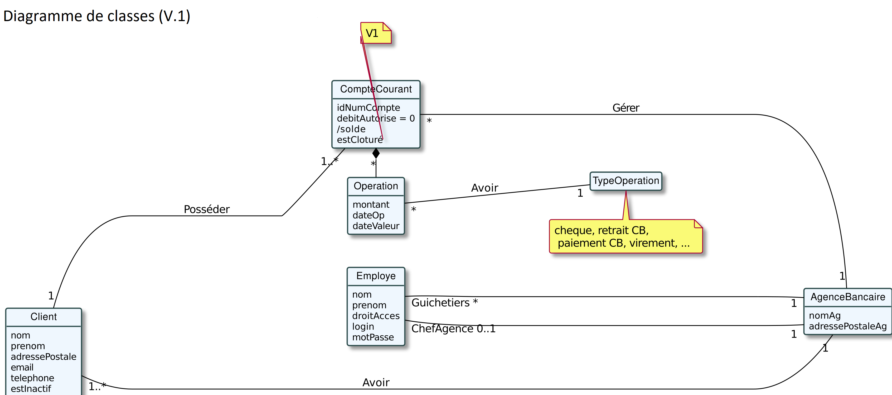

= Document Technique
:library: Asciidoctor
:idprefix:
:imagedir:
:toc: left
:css-signature: demo

.*Equipe de choc:*  

. DUBAYLE Arnaud,
. DEMEYERE Thomas, 
. GUILHAMASSÉ Quentin,
. NAUD Lilian

== *Rappel du sujet et contexte*

.*Contexte*
****
Pour s'adapter aux avancées technologiques, tous les secteurs doivent accroître leurs investissements dans la numérisation et reconstruire leurs services. Les banques, en particulier, doivent fournir la plupart des services à distance via des sites Web ou des applications pour accroître l'accessibilité et l'intérêt de leurs clients. 

Les stratégies de différenciation exigent des banques qu'elles innovent afin d'établir un avantage concurrentiel sur le marché. De plus recemment,  la pandémie de Covid19 a habitué les clients à tout faire à distance. De nouveaux concurrents sont entrés sur le marché.Des Néobanque. Par conséquent, les banques doivent fournir des services numériques efficaces pour répondre aux besoins des clients et  rester compétitives faces à ces nouveaux concurents.
****

.*Point de vu Client*
****
La banque *BankUniv* souhaite développer une application JAVA-Oracle de gestion des comptes clients pour remplacer plusieurs outils obsolètes.
L'application *Daily Bank* est un réseau français de 100 agences bancaires. Ils doivent restructurer leurs réseaux pour s'adapter à cette stratégie de différenciation sur un très grand marché en expension. Certains outils  obsolètes doivent être révisés dans les premières versions de l'application. En effet, les besoins bancaires évoluent ainsi que les besoins des clients, et de multiples fonctionnalités doivent être développées pour répondre à ces besoins.
****

.*Objectif*
****
L'objectif est de commencer avec une application existante et d'y ajouter des fonctionnalités. Il existe deux types d'utilisateurs de l'application : *le guichetier* et *le chef d'agence*. Le guichetier pourra créer de nouveaux clients et effectuer des transactions courantes. Le chef d'agence est en mesure de gérer des ressources et des opérations. L'application se décline en plusieurs versions selon les differentes demandes des clients.
****

== *Structure du projet*

====
.Diagramme stucture V0

====

====
.Diagramme stucture V1

====

====
.Diagramme stucture V2
image:images/new_dc-initialv2.png[]
====

== *Fonctionnalités Version 1*

=== *Créditer / Debiter un compte* (Thomas Demeyere)

==== Description de la fonctionalité

Cette fonctionalité permet à un agent banquaire de créditer ou de débiter un compte avec plusieurs methodes (Especes, virements...). Lorsque l'on rentre un montant inferieur ou égal à 0 le programme ne fait pas passer la transaction, il fait alors saisir un autre montant supperieur a 0 pour que cela fonctionne. Le débit d'un compte ne peut être effectué que si une fois le compte débité, le montant du compte est supperieur au découvert autorisé. Dans le cas contraire le débit est annulé.

==== Use Case
image:https://media.discordapp.net/attachments/962004101552545852/981462016109715456/unknown.png[alt="usecase"]

==== Classes et ressources utilisées
.Les classes et les ressources utilisées pour cette fonctionalité sont les suivantes :
* OperationManagement.java
* CategorieOperation.java
* OperationEditorPaneController.java
* OperationManagementController.java
* OperationEditorPane.fxml
* OperationManagement.fxml
* Operation.java
* TypeOperation.java
* AccessOperation.java
* AccesTypeOperation

==== Detail des resources
*OperationManagement.java :* +
Enregistrement des débit et des crédits grâce aux fonctions enregistrerDebit et enregistrerCredit.

*CategorieOperation.java:* +
Indique le type des opérations : débit et crédit.

*OperationEditorPaneController.java :*
Controlleur de la fenêtre "Enregistrement d'une opération". Permet de d'executer les commandes doAjouter, doCancel lorsque les bouttons associés sont préssés.

*OperationManagementController.java :* +
Controlleur de la fenêtre "Gestion des comptes". Permet d'effectuer les débits et crédits evec les commandes doCredit et doDébit et grâce aux boutons qui leurs sont associés.

*OperationEditorPane.fxml :* +
Fichier fxml correspondant à la fenêtre "Enregistrement d'une commande".

*OperationManagement.fxml :* +
fichier fxml correspondant à la fenêtre "Gestion des comptes".

*Operation.java :* +
Constructeur du Operation. Prends un identifiant d'operation, un montant, une date, une valeur de date, un numero de compte et un type d'opération en constructeurs.

*TypeOperation.java :* +
Constructeur de TypeOperation. Prends un identifiant de type d'opération en constructeur.

*AccessOperation :* +
Contient les fonction insertCredit et insertDebit qui vérifient que le débit est autorisé, enregistre l'opération et met a jour le solde

=== *Créer un compte* (Quentin Guihamassé)

=== *Effectuer un virement de compte à compte d'un même client*

=== *Clôturer un compte* (Lilian Naud)

=== *Gérer (CRUD) les employés (guichetier et chef d’agence)* (Arnaud Dubayle)

=== *Créer un nouveau * (Quentin Guilhamassé)

==== Description de la fonctionalité

Cette fonctionnalité permet de créer un nouveau compte pour un client déjà existant. On peut effectuer plusieurs opérations sur ce compte comme choisir un découvert autorisé et un solde( premier dépot). Ce solde doit être strictement supérieur à 50 euros. L'id du client, l'id d'agence et le numéro de compte son choisis au préalable et ne son pas modifiable. Une fois ajouté, le nouveau compte sera affiché dans le gestionnaire de comptes du client.

==== Classes et ressources utilisées
.Les classes et les ressources utilisées pour cette fonctionalité sont les suivantes :
* ComptesManagementController.java
* ComptesManagement.java
* AccessCompteCourant.java
* CompteEditorPane.fxml
* ComptesManagement.fxml
