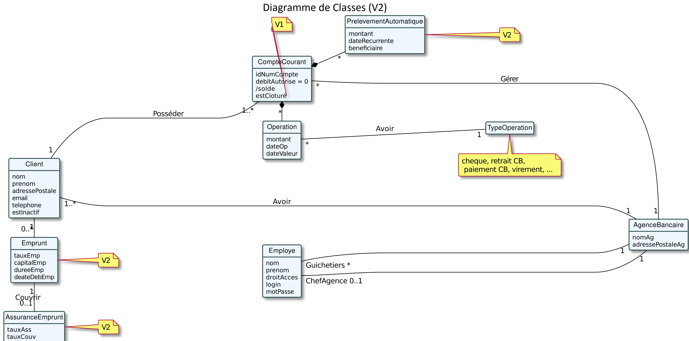

= Document Technique
:library: Asciidoctor
:idprefix:
:imagedir:
:toc: left
:css-signature: demo

.*Equipe de choc:*  

. DUBAYLE Arnaud,
. DEMEYERE Thomas, 
. GUILHAMASSÉ Quentin,
. NAUD Lilian

== *Rappel du sujet et contexte*

.*Contexte*
****
Pour s'adapter aux avancées technologiques, tous les secteurs doivent accroître leurs investissements dans la numérisation et reconstruire leurs services. Les banques, en particulier, doivent fournir la plupart des services à distance via des sites Web ou des applications pour accroître l'accessibilité et l'intérêt de leurs clients. 

Les stratégies de différenciation exigent des banques qu'elles innovent afin d'établir un avantage concurrentiel sur le marché. De plus recemment,  la pandémie de Covid19 a habitué les clients à tout faire à distance. De nouveaux concurrents sont entrés sur le marché.Des Néobanque. Par conséquent, les banques doivent fournir des services numériques efficaces pour répondre aux besoins des clients et  rester compétitives faces à ces nouveaux concurents.
****

.*Point de vu Client*
****
La banque *BankUniv* souhaite développer une application JAVA-Oracle de gestion des comptes clients pour remplacer plusieurs outils obsolètes.
L'application *Daily Bank* est un réseau français de 100 agences bancaires. Ils doivent restructurer leurs réseaux pour s'adapter à cette stratégie de différenciation sur un très grand marché en expension. Certains outils  obsolètes doivent être révisés dans les premières versions de l'application. En effet, les besoins bancaires évoluent ainsi que les besoins des clients, et de multiples fonctionnalités doivent être développées pour répondre à ces besoins.
****

.*Objectif*
****
L'objectif est de commencer avec une application existante et d'y ajouter des fonctionnalités. Il existe deux types d'utilisateurs de l'application : *le guichetier* et *le chef d'agence*. Le guichetier pourra créer de nouveaux clients et effectuer des transactions courantes. Le chef d'agence est en mesure de gérer des ressources et des opérations. L'application se décline en plusieurs versions selon les differentes demandes des clients.
****

== *Structure du projet*

====
.Diagramme stucture V0
image:images/dc-v0.png[]
====

====
.Diagramme stucture V1
image:images/dc-v1.png[]
====

====
.Diagramme stucture V2

====

== *Fonctionnalités Version 1*

=== *Créditer / Debiter un compte* (Thomas Demeyere)

=== *Créer un compte* (Quentin Guihamassé)

=== *Effectuer un virement de compte à compte d'un même client*

=== *Clôturer un compte* (Lilian Naud)

=== *Gérer (CRUD) les employés (guichetier et chef d’agence)* (Arnaud Dubayle)

